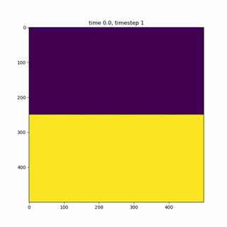

Course project for the course Numerical Methods in Scientific Computing 2025

Fluid simulation based on the solver found here:
https://www.dgp.toronto.edu/public_user/stam/reality/Research/pdf/jgt01.pdf

A sample:

How to run:

in the main.cpp file, there are two different test for the initial dye field and the initial force. Dye test 1 is a 50/50 of dye in the middle, dye test 2 is a series of stripes of dye. Force test 1 is a velocity shear in the middle with perturbation and force test 2 is a gaussian shock at the edge. One can also enable debug prints.

After choosing a force test and dye test, you can change simulation lenght, write intervals and other such parameters in the main function. 

The simulation writes output to 4 different files in output/: D, vx, vy, and timestep. These output files are then read by Dplotter and Vplotter to make videos of the simulation. 

To compile, run and plot the simulation, just run simulate.sh